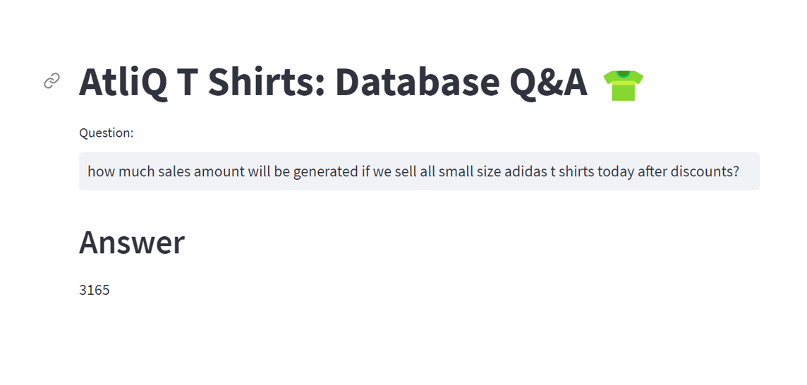

# AtliQ Tees: Talk to a Database with Voice Support 🎤

This is an end to end LLM project based on Google Palm and Langchain. We are building a system that can talk to MySQL database. 
User asks questions in a natural language (or by speaking!) and the system generates answers by converting those questions to an SQL query and
then executing that query on MySQL database. 

## 🆕 New Feature: Voice Input Support!
- **Speak your questions** - The system now supports browser-based speech recognition
- **No installation needed** - Uses your browser's built-in speech recognition
- **Works in Chrome, Edge, and Safari** - Click the microphone button to record your question

AtliQ Tees is a T-shirt store where they maintain their inventory, sales and discounts data in MySQL database. A store manager 
can ask questions by typing or speaking, such as:
- How many white color Adidas t shirts do we have left in the stock?
- How much sales our store will generate if we can sell all extra-small size t shirts after applying discounts?
The system is intelligent enough to generate accurate queries for given question and execute them on MySQL database



## Project Highlights

- AtliQ Tees is a t shirt store that sells Adidas, Nike, Van Heusen and Levi's t shirts 
- Their inventory, sales and discounts data is stored in a MySQL database
- We will build an LLM based question and answer system that will use following,
  - Google Palm LLM (Gemini 2.0 Flash)
  - Hugging face embeddings
  - Streamlit for UI
  - Langchain framework
  - Chromadb as a vector store
  - **Browser Speech Recognition** (Web Speech API) 🎤
  - Few shot learning
- In the UI, store manager can **ask questions by typing or speaking** in any language and it will produce the answers


## Installation

1. Clone this repository to your local machine using:

```bash
  git clone https://github.com/codebasics/langchain.git
```

2. Navigate to the project directory:

```bash
  cd 4_sqldb_tshirts
```

3. Install the required dependencies using pip:

```bash
  pip install -r requirements.txt
```

4. Acquire an API key through [makersuite.google.com](https://makersuite.google.com) and put it in `.env` file:

```bash
  GOOGLE_API_KEY="your_api_key_here"
```

5. For database setup, run `database/db_creation_atliq_t_shirts.sql` in your MySQL workbench

6. Create a `.env` file with your database credentials:

```bash
DB_USER=root
DB_PASS=your_password
DB_HOST=localhost
DB_NAME=atliq_tshirts
```

## Using Voice Input

### How to Use Voice Input
1. Make sure you're using Chrome, Edge, or Safari browser
2. Click the microphone button in the UI
3. Speak your question clearly
4. The transcribed text will appear in the text field automatically
5. Click submit to get your answer!

### Supported Browsers
- ✅ Chrome (recommended)
- ✅ Edge
- ✅ Safari
- ⚠️ Firefox (limited support)

**Note:** Voice input works best in a quiet environment with clear pronunciation.

## Usage

1. Run the Streamlit app by executing:
```bash
streamlit run main.py

```

2.The web app will open in your browser where you can ask questions

## Sample Questions
  - How many total t shirts are left in total in stock?
  - How many t-shirts do we have left for Nike in XS size and white color?
  - How much is the total price of the inventory for all S-size t-shirts?
  - How much sales amount will be generated if we sell all small size adidas shirts today after discounts?
  
## Project Structure

- `main.py`: The main Streamlit application script with voice input support
- `langchain_helper.py`: Contains all the langchain code for database queries
- `speech_recognition.html`: Browser-based speech recognition UI
- `few_shots.py`: Contains few shot prompts for better query generation
- `requirements.txt`: A list of required Python packages for the project
- `.env`: Configuration file for storing your Google API key and database credentials
- `database/db_creation_atliq_t_shirts.sql`: SQL script to create the database schema

## How It Works

1. **Text Input**: Type your question in the text field
2. **Voice Input**: Click the microphone button and speak your question
3. **Browser Recognition**: Your browser transcribes the audio to text
4. **LangChain**: Converts your question to SQL
5. **Database Query**: Executes the query on MySQL database
6. **AI Formatting**: Formats the result into a natural language response
7. **Display**: Shows the answer in a user-friendly format